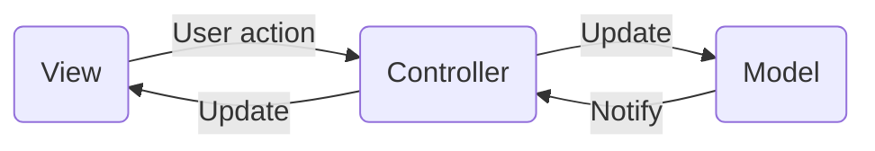

## 補足

エンティティに関してはentの利用でよさそうに感じている

ただ、いったんenityを作成する

クラス図を記載する

[クラス図](https://confrage.jp/vs-code%E3%81%A7plantuml%E3%82%92%E4%BD%BF%E3%81%A3%E3%81%A6%E3%82%AF%E3%83%A9%E3%82%B9%E5%9B%B3%E3%82%A2%E3%82%AF%E3%83%86%E3%82%A3%E3%83%93%E3%83%86%E3%82%A3%E5%9B%B3%E3%81%AE%E6%9B%B8%E3%81%8D/#toc1)

- Entities entのみで行けるか？ entityの利用か。
- usecase アプリケーションのやつ
- フレームワークとドライバー層 infrastructure - repository
- インターフェイス アダプタ層 cmd , config, api(handler,middleware,presenter)
- pkg ログや暗号化などのレイヤーにとらわれないもの

UMLで図を描く 現状はあくまで例である。
- アーキテクチャ図　architecture
- シーケンス図　sequence
    
Markdown Preview Mermaid Supportプラグインを入れることでmermaidが表示できる。

