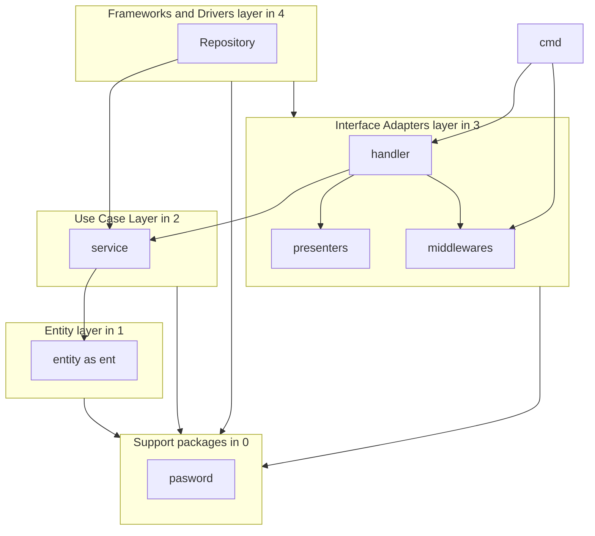

# 役割図
下記を参考としている。

https://eltonminetto.dev/en/post/2020-07-06-clean-architecture-2years-later/

https://github.com/golang-standards/project-layout/blob/master/README_ja.md

または、github の既存の処理を参考に良いと思ったものは導入していっていただければ、
- Entity layer - entity
  - entity - entityとそれの単体テスト entで対応可能な場合にはentityフォルダ不要
- Use Case Layer - usecase - アプリケーション固有のビジネス ルール
  - service - 機能のその他のビジネスケースを決める
- Interface Adapters layer - api - データを、データベース、Web などの外部エージェントのエンティティおよびユースケースで使用される形式に適応させて変換します。 - APIかコマンドラインアプリケーション（CLI）からアクセス可能
  - cmd - main https://github.com/eminetto/clean-architecture-go-v2/blob/master/cmd/main.go
    - コマンド用のメインがある。 ただし今回はapi_mainと同様の動きとする。
  - api_main - api用のメイン https://github.com/eminetto/clean-architecture-go-v2/blob/master/api/main.go
  - handler - ハンドラー パッケージは、ユースケースで既存のビジネス ルールを使用するだけでなく、HTTP 要求と応答を処理します。
  - presenters - プレゼンターは、ハンドラーによって応答として生成されるデータをフォーマットする責任があります。
  - middlewares - API用のcommon的な
- Frameworks and Drivers layer  - infrastructure - 通常、データベース、Web フレームワークなどのフレームワークとツール
  - Repository - DB関係
- Support packages - pkg - 暗号化、ロギング、ファイル処理などの一般的な機能を提供するパッケージ すべてのレイヤーで利用可能
  - pasword - パスワード

---------------

## デザインパターン図
